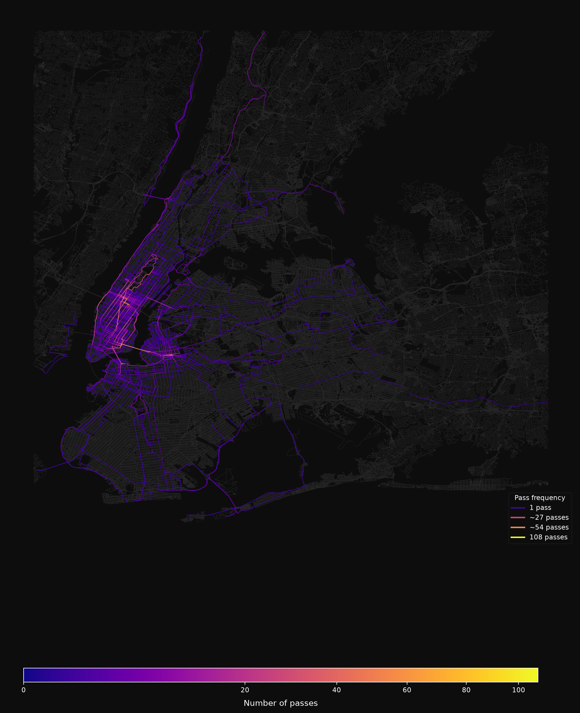

# NYC Bike Route Map

Visualizes personal bike ride data on the NYC street network. Processes GPS
ride logs, matches them to OpenStreetMap streets, and renders frequency and
coverage heatmaps.



## How It Works

1. Loads GPS ride data from CSV files (longitude, latitude, timestamp)
2. Filters to NYC area, splits rides at GPS gaps, resamples to even spacing
3. Fetches and merges OpenStreetMap bike/drive/walk street networks
4. Map-matches GPS traces to street edges using heading-aware spatial snapping
5. Routes between matched nodes, accumulates edge traversal counts
6. Renders coverage and frequency maps with matplotlib

All intermediate results are cached. First run takes ~10-25 minutes
(OSM download + full processing). Subsequent runs process only new rides
(~1-2 minutes).

## Setup

```bash
pip install .
```

Requires Python 3.9+.

## Usage

1. Place GPS ride CSVs in the `rides/` folder
2. Run the pipeline:

```bash
python bike_routes.py
```

3. Output images are saved to `bike_routes_coverage.png` and
   `bike_routes_frequency.png`

### Ride CSV Format

Each CSV file represents one ride with the columns:

```
longitude,latitude,timestamp
-73.98478,40.76030,2023-12-17 18:41:53 -0500
-73.98475,40.76035,2023-12-17 18:41:54 -0500
...
```

- One row per GPS fix, typically 1-second intervals
- Longitude and latitude in decimal degrees (WGS-84)
- Timestamp is used only for ordering (data should already be chronological)

## Configuration

Key parameters at the top of `bike_routes.py`:

| Parameter | Default | Description |
|-----------|---------|-------------|
| `RESAMPLE_SPACING_M` | 20 | Resample GPS points to this spacing (meters) |
| `SNAP_TOLERANCE_M` | 80 | Max distance to snap a GPS point to a street edge |
| `MAX_ROUTING_DISTANCE_M` | 2500 | Max route length between consecutive snapped nodes |
| `MAX_GPS_GAP_M` | 300 | Split ride into segments at gaps larger than this |
| `HEADING_PENALTY` | 0.15 | Penalty per degree of heading mismatch during snap |
| `HW_PENALTY` | (see code) | Per-highway-type snap bias (negative = prefer) |
| `NETWORK_TYPES` | bike, drive, walk | OSM network types to fetch |
| `SAMPLE_SIZE` | None | Limit number of rides processed (for testing) |

## Map-Matching Techniques

Raw GPS traces are noisy — points drift to sidewalks, parallel service roads,
or the wrong side of an intersection. The pipeline uses several techniques to
produce clean route matches:

- **Edge-based snapping** — GPS points snap to the nearest *edge* (perpendicular
  projection), not the nearest node, giving much more accurate placement.
- **Heading-aware snapping** — edges misaligned with the GPS travel direction are
  penalized (`HEADING_PENALTY` m/degree), preventing snaps to perpendicular
  cross-streets.
- **Highway-type preference** — `HW_PENALTY` biases snapping toward cycleways
  and away from footways, service roads, and motorways.
- **Edge densification** — virtual points are added every 150m along long edges
  so GPS traces on bridges and highways can find the correct edge even when its
  endpoints are far away.
- **Distance-gated loop removal** — detects A→...→A loops within a sliding
  window and collapses them, but only when all intermediate nodes stay within
  `LOOP_MAX_DETOUR_M` of the anchor. This cleans up zigzag noise from parallel
  footways without stripping legitimate forward-progress segments.

## Cache Files

The pipeline creates several cache files (auto-managed, gitignored):

- `osm_graph_cache.pkl` — merged OSM street graph (~260 MB)
- `state.pkl` — processed filenames, edge counts, config snapshot
- `render_cache.pkl` — pre-extracted edge geometries for rendering
- `route_cache.pkl` — shortest-path results between node pairs

Delete any cache file to force it to rebuild. Changing processing parameters
automatically triggers a full reprocess.

## License

MIT
