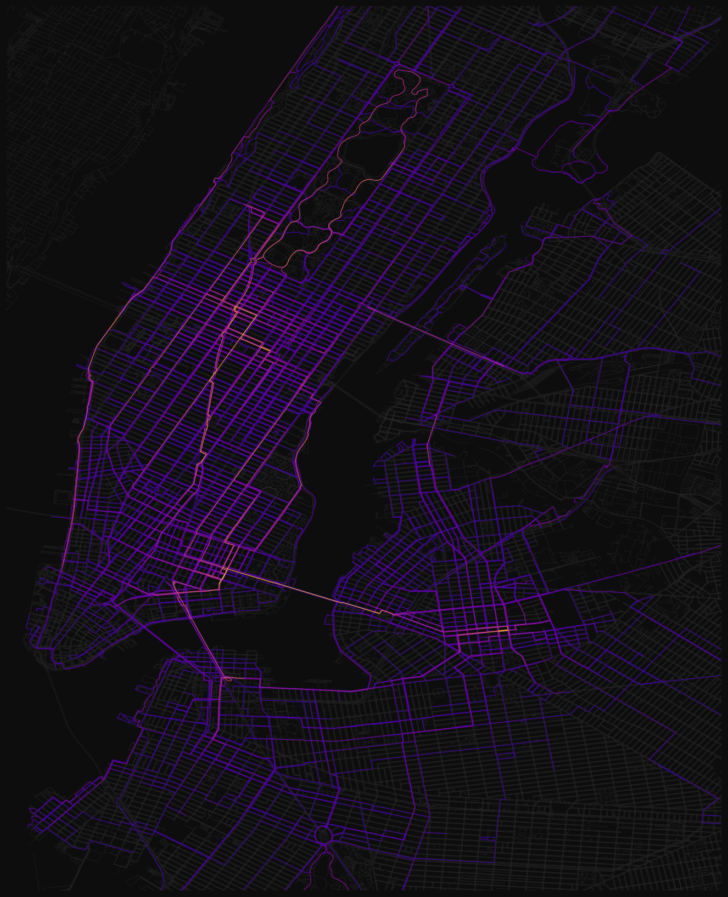

# NYC Bike Route Map

Visualizes personal bike ride data on the NYC street network. Processes GPS
ride logs, matches them to OpenStreetMap streets, and renders an interactive
zoomable map and static heatmaps.

**[View the live map](https://nikhilsaggi.github.io/bike-map/)**



*Brighter is more passes over the same street. Cropped to the core of the
network; a pipeline run renders everything ridden, most of which is a long
way outside this frame, as `bike_routes_frequency.png`.*

## Interactive Map

The pipeline exports a compressed GeoJSON that powers an interactive
[Leaflet](https://leafletjs.com/) map served via GitHub Pages. Features:

- Coloring by pass frequency — how many times each stretch was ridden, so an
  out-and-back counts twice
- Biggest direction splits: the corridors where riding one way is much
  faster than the other ([how it works](findings/direction-split-speed.md))
- Hover for the pass count, click for the full list of ride dates
- Popups (street or dock) drag by the bar at their top, so the box can be
  moved off the part of the map it is describing
- Date-range slider with time-lapse playback (watch the network grow)
- Collapsible stats panel with total rides, edges covered, and street
  miles
- Riding stats: distance/time totals, average speed, longest ride,
  miles and new-street miles per year, rides-by-hour and weekday
  histograms (data is stored metric; the UI displays miles)
- Optional neighborhood layer: NYC's tabulation areas, each filled by the
  share of its own streets ridden by the date on screen, so the slider and the
  time-lapse fill the city in. Click one for its coverage, the rides that went
  through it, and the measured distance and time ridden inside it
- A Neighborhoods stats section rolling those up per borough — a third of
  Manhattan's streets ridden against 4% of Queens', both hidden inside one
  citywide 11.8% ([why](findings/neighborhoods.md))
- Optional Citibike dock layer: markers sized by how much a dock was used in
  the date range on screen, so the slider and the time-lapse move them the way
  they move the streets. Click one to see where its trips actually went. The
  trips carry no GPS trace, so no route between docks is ever drawn and none
  of it counts toward the passes or the coverage figure
  ([why](findings/citibike-trips.md))
- Clicking a dock ghosts the pass heatmap the way selecting a ride does, so
  its lines read against the network instead of getting lost in it
- Where a GPS ride was recording during one of those trips, the row for that
  pair offers it: the recorded route in cyan over the straight line, which
  stays a placeholder. Where a pair has several, the row's chip and the up and
  down arrow keys step through them, newest first, and the bar at the top says
  which one is drawn. A recording can hold several trips, and the row says
  when the one on screen does
- Bike re-encounters: the panel lists every Citibike unlocked again after it
  had moved on — 88 of them, against 200 repeats that were only the bike
  parked and taken straight back. Each row gives the number of separate
  occasions and the days between them, and clicking one plays that bike's
  recordings through the same cycle a dock row uses
  ([what counts as one](findings/bike-reencounters.md))
- Bike type: classic against ebike over every trip — 7% ebike, and a floor
  rather than a count, because an ebike ride is only visible in the export
  when it was charged for (the chart's (?) says so)
- Fleet generation: trips per year stacked by which fleet the bike came from,
  read off the id shape — the newer bikes go from 41% of unlocks in 2021 to
  90% in 2026 ([what the id does and does not say](findings/citibike-trips.md))
- Ride source: each GPS ride is matched to Citibike trips by clock overlap and
  labelled where it appears, and the legend can filter the whole network to
  Citibike or own-bike rides. Rides outside the Citibike history are left
  unknown rather than assumed

To view locally:

```bash
python -m bike_routes         # generates docs/rides.geojson.gz
python -m http.server 8000 --directory docs
```

## Setup

```bash
pip install .
```

Requires Python 3.9+.

## Usage

1. Place GPS ride CSVs in the `rides/` folder (or GPX files in `incoming/` —
   `python -m bike_routes.ingest.garmin_sync incoming/` fetches them from
   Garmin Connect)

2. If using GPX files, convert them first:

   ```bash
   python -m bike_routes.ingest.gpx_to_csv incoming/ rides/
   ```

3. Run the pipeline:

   ```bash
   python -m bike_routes
   ```

   Optional flags:

   ```
   --sample N               process only the first N ride files
   --rides FILE [FILE ...]  process only these ride CSV filenames
   --no-png                 skip rendering the static PNG maps
   --workers N              worker processes for map matching (1 = sequential)
   ```

4. Optional — add Citibike trips. Export them from
   `account.citibikenyc.com` with the
   [baywheels console script](https://github.com/fhoffa/code_snippets/blob/master/baywheels/readme.md),
   then:

   ```bash
   python -m bike_routes.ingest.citibike ~/citibikenyc_history_YYYY-MM-DD.json
   ```

   These are dock-to-dock records with no GPS trace, so they never join the
   drawn edges or the coverage figure — they become their own toggleable dock
   layer plus a stats section. Once the cache exists, every later
   `python -m bike_routes` picks it up with no flag.

   That script stops at a **one-year** cutoff, so an ordinary pull is a
   window rather than a history. The ingest **merges** into the cache on
   Lyft's own ride id, which makes a default pull a safe top-up rather than
   a truncation — re-run it as often as you like. Three lines it prints are
   worth reading, each catching a different failure:

   - the **span of the merged result** should still start where your history
     does. Starting a year ago means the merge did not happen and you are
     looking at a truncated cache.
   - **`N already known` should be large.** A top-up mostly restates trips
     you have. Zero means the export did not overlap the cache at all, so
     there is a gap between them: pull a wider window.
   - **the docks `placed by GBFS`** should hold roughly steady. A sharp drop
     is the feed's naming changing rather than docks vanishing; the ingest
     names every dock it could not place.

   `--replace` discards the cached trips instead of merging, and is only
   right when the cached records are themselves wrong. It is also the way out
   of a cache too damaged to read, which the ingest otherwise refuses to
   overwrite.

   **The cache accumulates what no single export can rebuild.** It is
   gitignored and an ordinary pull reaches back only a year, so anything
   older lives in `cache/citibike_trips.json` and in the full export you
   first ingested — keep that file.

5. Outputs:
   - `docs/rides.geojson.gz` — interactive map data
   - `bike_routes_coverage.png` and `bike_routes_frequency.png` — static images

### Ride CSV Format

Each CSV file represents one ride with the columns:

```
longitude,latitude,timestamp
-73.98478,40.76030,2023-12-17 18:41:53 -0500
-73.98475,40.76035,2023-12-17 18:41:54 -0500
...
```

- One row per GPS fix, typically 1-second intervals
- Longitude and latitude in decimal degrees (WGS-84)
- Timestamps order the trace, and are what the pass counts and the
  direction-split speeds are measured from

## How It Works

1. Loads GPS ride data from CSV files (longitude, latitude, timestamp)
2. Filters to NYC area, splits rides at GPS gaps, resamples to even spacing
3. Fetches and merges OpenStreetMap bike/drive/walk street networks
4. Map-matches each trace to a path through the street network with a hidden
   Markov model (see below)
5. Projects each ride's timestamped trace back onto its matched edges to
   recover how many times it swept each stretch, and how fast, per direction
6. Collapses parallel and duplicate street geometries into single corridors,
   combining their pass counts
7. Exports GeoJSON (gzipped) for the interactive map + renders static PNGs

Steps 4 and 5 are deliberately separate: the matcher returns a path, not a
count, and the pass counts the map colours by are measured from the raw
timestamped fixes.

All intermediate results are cached. First run takes longer
(OSM download + full processing). Subsequent runs process only new rides.

## Map-Matching

Raw GPS traces are noisy — points drift to sidewalks, parallel service roads,
or the wrong side of an intersection. Traces are matched with a hidden
Markov model matcher
([leuvenmapmatching](https://github.com/wannesm/LeuvenMapMatching)): each
observation gets candidate street edges, transitions are scored by route
plausibility, and the most likely path through the street network is decoded
jointly. Compared to per-point snapping this eliminates parallel-way
oscillation and block-sized routing detours — matched path length is ~1.1x
the GPS track length vs ~2x with the previous heuristic. Stretches the
model cannot explain (off-network riding, GPS teleports) are retried with a
wider beam, then skipped, and matching resumes past them.

The network the matcher chooses from is not the whole graph. OSM maps the
pavements either side of a street as their own `footway` ways, and the
composed walk network contributes two thirds of the graph's edges, so a
matcher with no notion of rideability puts a great deal of riding on the
sidewalk — 43% of drawn kilometres, before this filter. A `footway` or
`steps` edge with a roadway running parallel closer than
`SIDEWALK_PARALLEL_M` is treated as a sidewalk and kept out of the matching
map; the full graph still supplies geometry, coverage and drawing, so a ride
that really was on a footway still draws there
([details](findings/sidewalk-matching.md)).

The original heuristic matcher (heading-aware edge snapping with
highway-type penalties, shortest-path routing, and loop removal) is kept
and selectable with `MATCHER = "heuristic"` in `bike_routes/config.py`.
Changing the matcher or its parameters triggers a full reprocess
automatically.

## Configuration

Everything is in `bike_routes/config.py`, commented per parameter. The ones
worth knowing about:

| Parameter | Default | Description |
|-----------|---------|-------------|
| `MATCHER` | hmm | Map-matcher: `hmm` (Viterbi) or `heuristic` (edge snapping) |
| `HMM_MAX_DIST` | 80 | Max GPS-to-edge distance considered (meters) |
| `HMM_OBS_NOISE` | 15 | Expected GPS noise (meters) |
| `HMM_LATTICE_WIDTH` | 8 | Viterbi beam width (widened to 24 on retry) |
| `SIDEWALK_PARALLEL_M` | 12 | A footway this close to a parallel roadway is a sidewalk, and is kept out of the matcher |
| `RESAMPLE_SPACING_M` | 20 | Resample GPS points to this spacing (meters) |
| `MAX_GPS_GAP_M` | 300 | Split ride into segments at gaps larger than this |
| `NETWORK_TYPES` | bike, drive, walk | OSM network types to fetch |
| `SAMPLE_SIZE` | None | Limit number of rides processed (for testing) |
| `SPEED_VERSION` | 6 | Bump to recompute passes and speeds (no rematch) |
| `SPEED_SNAP_M` | 25 | Max GPS-to-edge distance for a fix to count as on-edge |
| `SPEED_CHUNK_M` | 150 | Long ways are measured in chunks this size |
| `TRAVERSAL_MIN_COVER` | 0.5 | Fraction of an edge a counted pass must sweep |
| `TRAVERSAL_RESUME_M` | 30 | Slack for rejoining one pass split across fragments |
| `MERGE_TOL_M` | 20 | Parallel features within this may merge into one corridor |

Changing anything the matcher sees triggers a full reprocess of every ride;
the pass/speed parameters are backfilled from timestamps instead, so they
recompute on a `SPEED_VERSION` bump without rematching. Before changing a
`TRAVERSAL_*` or `SPEED_*` threshold, run `python tools/traversal_audit.py`
against real rides — a synthetic grid cannot tell you whether it over-fires.

## Updating the Map

Rides come off a Garmin watch. `update.py` does the whole loop — fetch new
rides, convert, reprocess, commit — on Windows, WSL, macOS, or Linux:

```bash
python update.py         # or python update.py --days 30 to narrow the lookback
git push                 # GitHub Pages serves docs/ straight from main
```

It leaves the commit unpushed on purpose, so you can look at the map first.

This runs locally rather than in CI, deliberately. The ride CSVs and the
~260 MB OSM graph cache already live on this machine, and Garmin's login
sits behind Cloudflare TLS fingerprinting that tends to block datacenter IPs
— so a home network is both simpler and likelier to work than a runner.

Garmin has no personal-use API, so `bike_routes.ingest.garmin_sync` uses the
endpoints the Connect web UI uses, via
[python-garminconnect](https://github.com/cyberjunky/python-garminconnect).
Log in once to leave a token in `~/.garminconnect` and the sync reads it on
its own from then on:

```bash
pip install '.[garmin]'
python -c "
from garminconnect import Garmin
Garmin(input('email: '), input('password: '),
       prompt_mfa=lambda: input('MFA code: ')).login('~/.garminconnect')
"
```

See [findings/garmin-access.md](findings/garmin-access.md) for token
lifetime, the `GARMINTOKENS` override, and what to do about a 429.

## Analysis

`tools/` holds standalone scripts that read the pipeline's output but are not
part of it; `findings/` holds what they found:

- [Direction-split speed](findings/direction-split-speed.md) — reconstructing
  the Manhattan Bridge's elevation profile from timestamps, and why the
  result is a ranked list rather than a map layer
- [Weather correlation](findings/weather-correlation.md) —
  `tools/weather_correlation.py`, joining rides against Open-Meteo history
- [Garmin access](findings/garmin-access.md) — how ride ingest authenticates
  and how to unstick it
- [Traversal counting](findings/traversal-counting.md) — how a pass is
  detected from raw fixes, and why a corridor's members combine the way they do
- [Citibike trips](findings/citibike-trips.md) — a second source with no
  trace: why it has no speed, why its routes are never drawn, and what two
  discarded layers taught about the difference
- [Bike re-encounters](findings/bike-reencounters.md) —
  `tools/bike_reencounters.py`, on whether meeting the same Citibike twice
  beats chance (it does not, once the round trips come out)
- [Sidewalks in the matching map](findings/sidewalk-matching.md) — why 43%
  of drawn kilometres were pavement, and how a sidewalk is told from a
  greenway without asking OSM
- [Rides by neighborhood](findings/neighborhoods.md) — half the coverage
  denominator was not New York City, what the per-area cut says instead, and
  where assigning an edge by its midpoint goes wrong

`tools/hmm_matcher_eval.py` compares the two matchers on real rides,
`tools/traversal_audit.py` checks pass counting against the raw traces, and
`tools/neighborhood_audit.py` cuts the coverage measurement into
neighborhoods (`--boundaries` also measures what midpoint assignment
misplaces). `tools/bike_reencounters.py` re-derives the Citibike panel's
re-encounter list from `cache/citibike_trips.json` alone, and tests it against
chance — the two permutation tests the panel does not draw.
`tools/render_readme_map.py` re-renders the image at the top of this file
from the caches, when it should catch up with the rides.

## Repository Layout

```
bike_routes/        the pipeline, one stage per module
  ingest/           Garmin download, GPX -> CSV, Citibike export (the front)
docs/               the published Leaflet map + its rides.geojson.gz
tools/              standalone analysis run by hand, not part of the pipeline
findings/           write-ups of what that analysis found
tests/              pytest suite (synthetic grids) + Playwright e2e for docs/
rides/              ride CSVs (gitignored -- personal GPS traces)
cache/              everything the pipeline generates (gitignored)
sample_output/      the cropped map image at the top of this README
update.py           fetch -> convert -> reprocess -> commit, in one command
```

## Cache Files

The pipeline keeps everything it generates in `cache/` (auto-managed,
gitignored):

- `cache/osm_graph_cache.pkl` — merged OSM street graph (~260 MB)
- `cache/hmm_map_cache.pkl` — HMM matcher's map index (nodes + adjacency);
  lets runs and worker processes skip loading the full graph
- `cache/state.pkl` — processed filenames, edge counts, per-edge passes and
  speeds, config snapshot
- `cache/render_cache.pkl` — pre-extracted edge geometries, highway classes,
  names
- `cache/route_cache.pkl` — shortest-path results between node pairs
- `cache/cache_versions.json` — osmnx/networkx versions that wrote the graph
- `cache/weather_cache.json` — Open-Meteo daily weather, so a failed API call
  falls back to the last good copy
- `cache/citibike_trips.json` — the normalised Citibike account export
  (written by `ingest.citibike`, absent until you run it)
- `cache/citibike_stations.json` — GBFS dock coordinates, so a failed fetch
  falls back to the last good copy
- `cache/nta_boundaries.geojson` — NYC neighborhood boundaries, downloaded
  once from NYC Open Data on the first run and never refreshed; delete it and
  the map ships without the neighborhood layer until the next run

Delete any cache file — or the whole directory — to force a rebuild.
Changing processing parameters automatically triggers a full reprocess, and
upgrading osmnx/networkx automatically refetches the graph (pickled graphs
are version-bound).

## Tests

The map-matching, merge, and pass-counting logic is covered by a pytest suite
using small synthetic street grids (no OSM download or ride data needed):

```bash
pip install pytest
pytest
```

`tests/e2e/` covers `docs/index.html` with Playwright against a synthetic
GeoJSON (`npm install && npx playwright test`). Both run in CI on every push
and pull request.

## License

MIT
