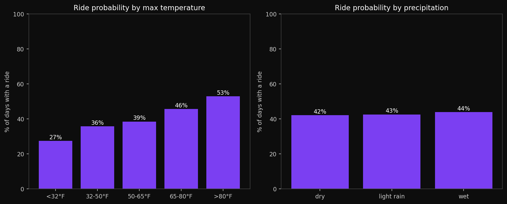

# Weather Correlation

`tools/weather_correlation.py` joins the exported ride index against
[Open-Meteo](https://open-meteo.com/) historical daily weather (keyless)
and reports how temperature and precipitation affect ride probability and
distance:

```bash
python tools/weather_correlation.py            # prints stats, writes chart
python tools/weather_correlation.py --no-chart # stats only
```



Daily weather is cached in `cache/weather_cache.json`, so a failed API call
falls back to the last good copy.
